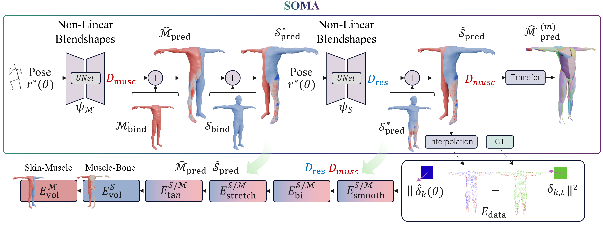
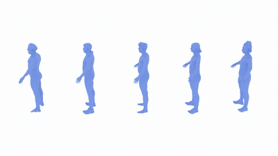
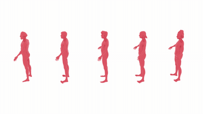
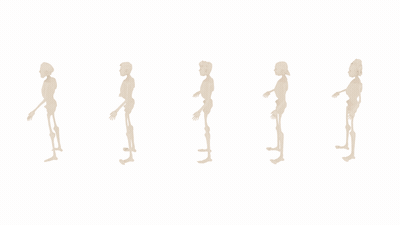

<div align="center">

## SOMA: From Surface Observations to Muscle Anatomy
<!-- TODO: venue & year once known -->

[Eduardo Alvarado](https://edualvarado.com/)<sup>1</sup>, [Emily Kim](https://kimemily12.github.io/publications/)<sup>1</sup>, [Gerrit Nolte](https://cg.cs.tu-dortmund.de/people/nolte_gerrit.html)<sup>2</sup>, [Friedemann Runte](https://cg.cs.tu-dortmund.de/people/runte_friedemann.html)<sup>2</sup>, [Mario Botsch](https://ls7-gv.cs.tu-dortmund.de/people/botsch_mario.html)<sup>2</sup>, [Marc Habermann](https://people.mpi-inf.mpg.de/~mhaberma/)<sup>1</sup>, [Christian Theobalt](https://people.mpi-inf.mpg.de/~theobalt/)<sup>1</sup>

<sup>1</sup> [Max Planck Institute for Informatics, Saarland Informatics Campus](https://www.mpi-inf.mpg.de/departments/visual-computing-and-artificial-intelligence) &nbsp;&nbsp; <sup>2</sup> [TU Dortmund University](https://www.tu-dortmund.de/en/)

<!-- TODO: replace "(to be uploaded)" with real links when available -->
[**Project page**](https://vcai.mpi-inf.mpg.de/projects/SOMA/) | [**Paper**](https://arxiv.org/abs/2606.09246) | **Video** *(to be uploaded)* | **Data** *(to be uploaded)*


</div>

---

## Abstract

With the growing demand for realistic virtual humans, parametric body models have become a
cornerstone of modern medicine, sports, and entertainment applications. However, most of
these models are inherently limited: they only capture the 3D surface of the skin, offering
no insight into the complex bio-mechanical structures that generate motion. Traditional
soft-tissue simulations, such as FEM, are accurate but non-scalable and too computationally
expensive for most common applications. Alternatively, existing biomechanical tools can
simulate muscular forces and activations, but do not model changes in external shape,
restricting how activations correlate with actual observable anatomy. This motivates a novel
inverse research problem: recovering muscle deformations directly from visible surface
observations — i.e., from the skin, and thus the pose. In this work, we present **SOMA**
(from **S**urface **O**bservations to **M**uscle **A**natomy), a person-specific model that
infers spatio-temporal muscle behavior from surface signals obtained using RGB cameras, and
**SKIM**, a subject-specific soft-tissue deformation dataset. To the best of our knowledge,
this is the first method that attempts to recover muscle deformations from multi-view RGB
data. We show how our method provides anatomically grounded animations without the complexity
of traditional simulations, leading to a scalable and cost-effective solution.

---

## Method

SOMA builds on the idea of pose-dependent corrective blendshapes, but extends them from a
single skin surface to a **volumetric, multi-layer anatomy**. Given a skeletal pose, two
cascaded non-linear U-Nets predict a muscle displacement field *D<sub>musc</sub>* that drives
the bulging of the underlying muscle layer, and a residual offset *D<sub>res</sub>* that lets
the skin slide and compress over the tissue instead of rigidly following the muscle. Because
recovering these layers from sparse surface markers alone is ambiguous, we supervise the
network with the canonical marker residuals from SKIM and regularize it with a set of
**biomechanically inspired priors**: area-normalized Laplacian smoothness and biharmonic
bending resistance, edge-stretching and tangential-sliding constraints, and a prism-based
volume-preservation term that enforces the near-incompressibility of soft tissue. Finally,
the learned boundary deformation is propagated to high-resolution individual muscle meshes
through a precomputed barycentric binding, yielding anatomically grounded, spatio-temporal
muscle animation directly from pose.

<div align="center">

</div>

---

## Results

<div align="center">
<table>
<tr>
<td></td>
<td></td>
<td></td>
<td></td>
</tr>
</table>
</div>

---

## SKIM Dataset (Skin-to-Internal Muscle)

Inferring internal muscle deformation from RGB video is inherently ill-posed, since only the
skin surface is observed. **SKIM** resolves this by pairing high-precision, temporally
consistent skin annotations with an individualized volumetric muscle template. Each of the
five subjects wears a custom skin-tight suit embedded with ArUco markers and is captured in a
120-camera markerless motion-capture studio, while a separate 140-camera scanner reconstructs
high-resolution static templates of the skin, muscle, and skeleton layers, together with
individual muscle meshes. Detected markers are unwrapped into a canonical point cloud, bound
to the underlying muscles, tracked across motion, and converted into pose-normalized residual
deformation fields that capture subject-specific soft-tissue dynamics. In total, SKIM provides
**45 minutes** of multi-view recordings with ground-truth skeletal poses, marker trajectories,
visibility masks, and the full multi-layer anatomy for each subject.

<div align="center">
<table>
<tr>
<td></td>
<td></td>
<td></td>
</tr>
</table>
</div>

---

## Repository structure

This repository contains the **source code** for the full pipeline, organized into sequential
stages; each stage has its own README. Bulk data (per-subject captures, model checkpoints,
Blender scenes, generated meshes) is **not** tracked — see [`.gitignore`](.gitignore).

| Stage | Directory | What it does | Docs |
|-------|-----------|--------------|------|
| 1 | `01-Suit-Processing/` | 2D detection, triangulation & 3D tracking of suit markers; suit manufacturing toolkit | [README](01-Suit-Processing/README.md) |
| 2 | `02-Canonical-Model/` | Build the canonical (rest-pose) marker model; UV marker detection & annotation | [README](02-Canonical-Model/README.md) |
| 3 | `03-Registration/` | Compute marker Linear Blend Skinning (LBS) weights against the canonical model | [README](03-Registration/README.md) |
| 4 | `04-Blender/` | Blender tooling: markers, residuals, Laplacian/dense deformation, reconstruction | [README](04-Blender/README.md) |
| 5 | `05-Training/` | Preprocess data, train the deformation network, validate, evaluate, visualize | [README](05-Training/README.md) |
| 6 | `06-Evaluation/` | Biomechanical evaluation (muscle/skin intersection, volume stability), SMPL alignment | — |

---

## Quick Start

### Requirements
- **Python:** 3.9+
- **PyTorch:** install the build matching your CUDA toolkit — see the
  [official guide](https://pytorch.org/get-started/locally/).
- **Blender:** the scripts under `04-Blender/scripts/` run **inside Blender** and use its
  built-in Python API (`bpy`, `mathutils`, `bmesh`, `gpu`); these are not pip packages.

### Installation

1. Clone this repository.
2. Create and activate a virtual environment:
     ```bash
     python -m venv env
     source env/bin/activate        # Windows: .\env\Scripts\activate
     ```
3. Install dependencies:
     ```bash
     pip install -r requirements.txt
     ```
4. Install PyTorch according to your compute platform.

> **Note:** versions in [`requirements.txt`](requirements.txt) are unpinned; the code was
> developed against a specific CUDA/PyTorch stack on a SLURM cluster. Pin as needed.

---

## Data Preparation

Per-subject SKIM data (subjects S1–S5) is not included in this repository. Each subject
provides:

- `preprocessed_vFinal_clean/` — processed training frames
  (`pose_rotations/`, `residuals/`, `masks/`, `canonical_lbs/`)
- `canonical_model/` — rest-pose mesh
- `validation/` — held-out evaluation sequences

The train/validation split is 90/10; validation frame paths are stored in
`05-Training/S{N}_validation_filepaths.json`.

Preprocess raw BVH / residual data into training tensors:
```bash
cd 05-Training
python 00_preprocess_data.py
```

---

## Training

The architecture is selected via the `ARCH` variable in
[`05-Training/01_end_to_end_training.py`](05-Training/01_end_to_end_training.py)
(`"linear"`, `"mlp"`, or `"unet"`); loss weights live in the `LAMBDAS` dict in the same file.

```bash
cd 05-Training
python 01_end_to_end_training.py        # interactive
# or, on a SLURM cluster:
sbatch 01_end_to_end_training_job.sh
```

### Loss terms

| Loss | Key | Purpose |
|------|-----|---------|
| Data | `w_data` | Marker tracking via barycentric interpolation |
| Laplacian smoothness | `w_smooth_musc/skin` | Spatial coherence |
| Biharmonic energy | `w_biharmonic_musc/skin` | Second-order smoothness / wrinkle control |
| Spring energy | `w_spring_musc/skin` | Stretch resistance |
| Tangential energy | `w_tangent_musc/skin` | Prevent normal sliding |
| Volume preservation | `w_vol_musc/skin` | Prism volume loss (2-point Gauss quadrature) |

---

## Evaluation & Visualization

```bash
cd 05-Training
python 02_validate_training.py
python 03_evaluate_metrics.py
python ../06-Evaluation/hit_bio_evaluation.py     # muscle/skin intersection, volume stability
```

`06-Evaluation/hit_bio_evaluation.py` computes the intersection ratio (% of muscle vertices
penetrating skin), the volume coefficient of variation (frame-to-frame stability), and
alignment to the SMPL body model (`smpl_alignment.py`). Visualization helpers are the
`A_`–`H_` prefixed scripts in `05-Training/`.

---

## Citation

If you use this project in your research, please cite:

```bibtex
@misc{2026:alvarado:soma,
  author = {Alvarado, Eduardo and Kim, Emily and Nolte, Gerrit and Runte, Friedemann and Botsch, Mario and Habermann, Marc and Theobalt, Christian},
  title  = {SOMA: From Surface Observations to Muscle Anatomy},
  year   = {2026},
}
```

---

## License

<!-- TODO: choose a license and add a LICENSE file (e.g. MIT) -->
TODO.
